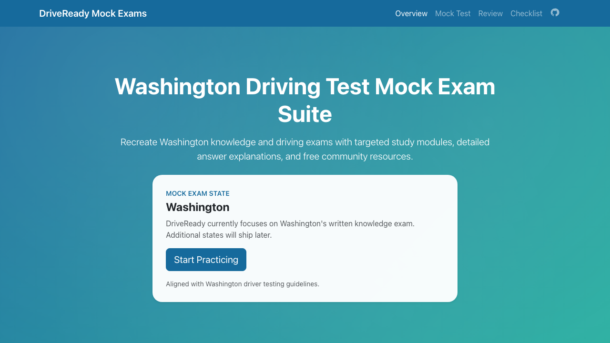
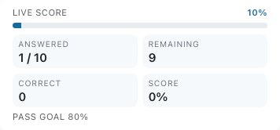
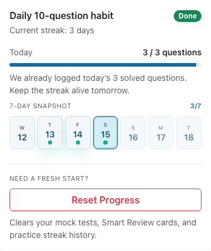
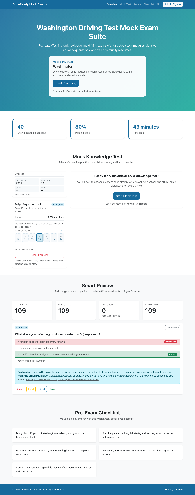
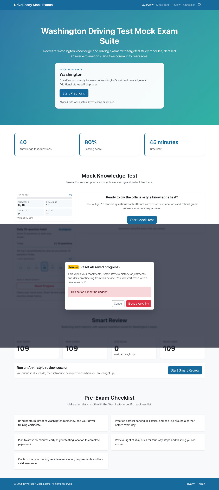

# DriveReady User Guide

DriveReady is your companion for preparing for Washington’s knowledge exam. Use this guide as a visual tour of the experience—you’ll see where to start practice sessions, how progress is tracked, and how to reset when you want a clean slate. Every section pairs short steps with the exact UI you’ll see in the app.

> **Tip:** Open https://hindol.github.io/drive-ready/ in another tab as you read. You can follow along in real time, mirroring each flow shown below.

## 1. Explore the landing page & navigation

1. Load the live site and start at the hero panel. It highlights Washington’s requirements, success stats, and a friendly CTA to get you practicing.
2. Scan the cards below the hero for key reminders (Washington stats, pre-exam checklist, and habit tracker entry point).
3. Use the sticky navbar links—Overview, Mock Test, Smart Review, Checklist—to jump to the feature you need. The GitHub icon on the right opens the open-source repository if you’re curious about the code.

## 2. Take a mock knowledge test

1. Press **Start Mock Test** from the hero or Mock Test section.
2. Read the scenario, pick your answer, and immediately see whether you were correct.
3. Expand the explanation drawer to understand the rule, complete with a Washington Driver Guide citation and quick reference link.
4. Click **Save & Next** after each question (or **Finish Test** on the last one) to keep the flow moving.

## 3. Track the Daily 10-question habit

1. After you answer a question, glance at the **Daily 10-question habit** card on the right.
2. The progress bar shows how close you are to finishing today’s target (default: 10 questions) and logs the exact count underneath.
3. The mini calendar highlights your streak: completed days get green dots, today is outlined, and upcoming days stay subtle so you can focus on the present.
4. Keep hitting the daily goal to extend your streak and build momentum toward test day.

## 4. Run Smart Review sessions

1. Scroll to the **Smart Review** panel and choose **Start Smart Review**.
2. Work through the cards one at a time—picking an answer reveals the explanation, citation, and a quick recap of the concept.
3. Use the rating buttons (Again, Hard, Good, Easy) to tell DriveReady how confident you felt. The spaced-repetition engine uses that feedback to reschedule the card at the ideal time.

## 5. Reset your progress (optional)

1. Want a clean slate? Click **Reset Progress** beneath the habit tracker.
2. Read the warning carefully—this action deletes mock test history, Smart Review data, and practice streaks stored in your browser.
3. Select **Erase everything** if you’re sure, or **Cancel** to keep your current data.

---

DriveReady will keep expanding with more Washington-specific drills, checklists, and review tools. Bookmark the app and revisit often—you’ll keep your streak alive, sharpen your recall, and head into your DMV appointment with confidence.
